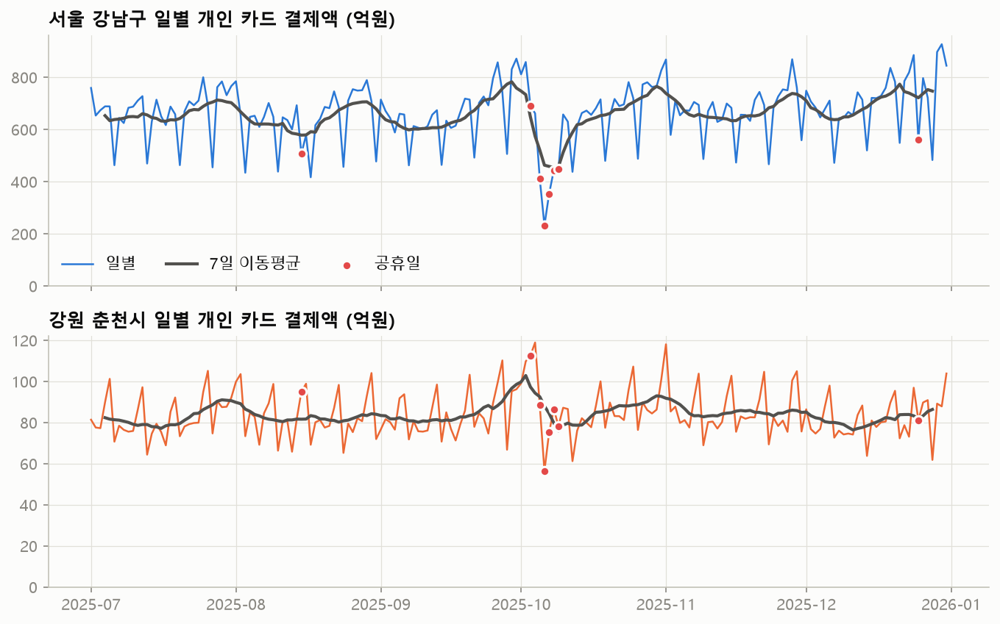
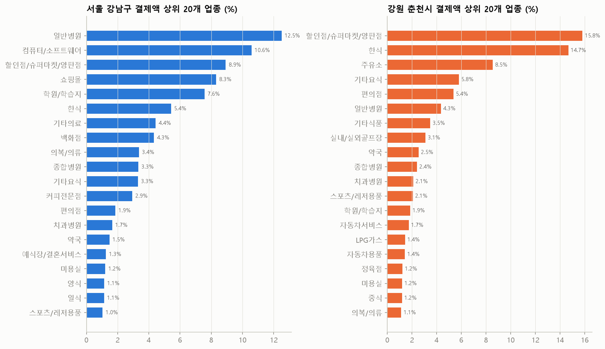
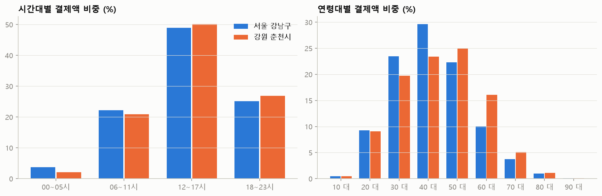
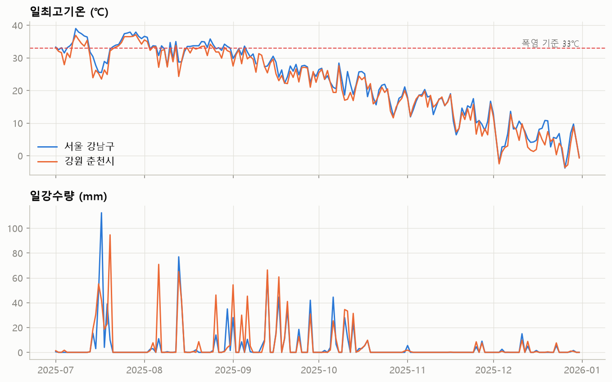
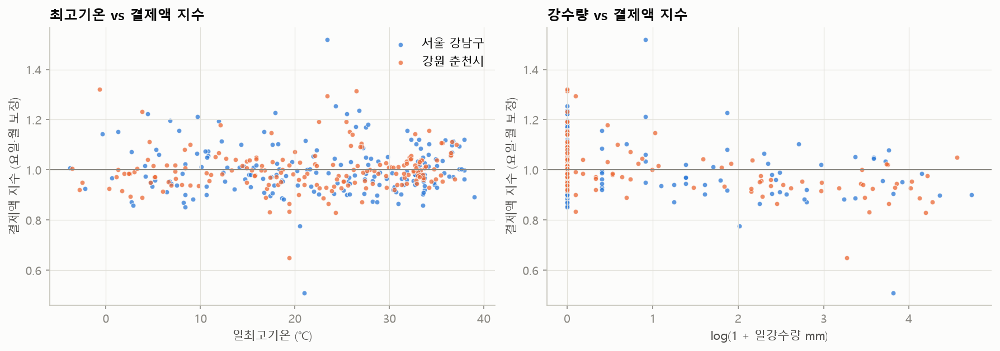
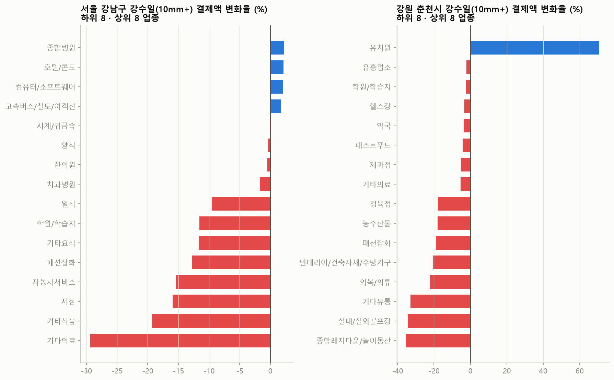
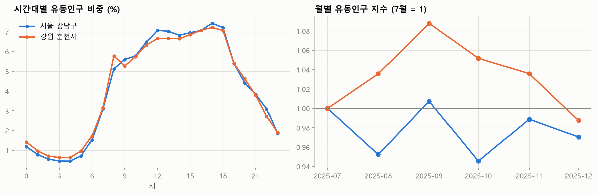

# 기본 EDA 요약

재생성: `uv run --no-project --with pandas --with matplotlib python -X utf8 scripts/eda_basic.py`

## 1. 카드 데이터 구조와 품질

### 데이터1 (일×6시간대)
- 행 수 1,044,710 / 기간 2025-07-01 ~ 2025-12-31 (184일)
- 결측: 없음
- 키 중복 행: 0
- 결제건수 최솟값 5 → 5건 미만 셀은 비식별 처리로 빠진 것으로 보임
- 업종 수 91, 성별 ['남성', '법인', '여성']
- 총 결제액 358,659억원, 총 건수 612,350,360

### 데이터2 (일×고객거주지)
- 행 수 1,806,800 / 기간 2025-07-01 ~ 2025-12-31 (184일)
- 결측: 없음
- 키 중복 행: 0
- 결제건수 최솟값 5 → 5건 미만 셀은 비식별 처리로 빠진 것으로 보임
- 업종 수 90, 성별 ['남성', '여성']
- 총 결제액 301,511억원, 총 건수 571,833,984

- 데이터1의 '법인' 행 비중: 행 5.9%, 결제액 15.9%
- 결제액 상위 셀(이상치 후보):

|   TA_YMD |   TIME_GB | MCT_SGG_CD   | MCT_RY_CD   | SEX_CCD   |        TS_AT |   USE_CNT |   건당금액(만원) |
|---------:|----------:|:-------------|:------------|:----------|-------------:|----------:|-----------:|
| 20250806 |     12_17 | 서울 강남구       | ZZ_나머지      | 법인        | 520512895491 |     16270 |       3199 |
| 20250904 |     12_17 | 서울 강남구       | ZZ_나머지      | 법인        | 299091722044 |     19579 |       1528 |
| 20251229 |     12_17 | 서울 강남구       | 세금공과금       | 남성        | 289646721166 |      7773 |       3726 |
| 20251010 |     12_17 | 서울 강남구       | ZZ_나머지      | 법인        | 173658599830 |     13753 |       1263 |
| 20250704 |     12_17 | 서울 강남구       | ZZ_나머지      | 법인        | 160960081300 |     16069 |       1002 |
| 20251204 |     12_17 | 서울 강남구       | ZZ_나머지      | 법인        | 118230904057 |     20916 |        565 |
| 20251106 |     12_17 | 서울 강남구       | ZZ_나머지      | 법인        |  95442109367 |     16879 |        565 |
| 20251201 |     06_11 | 서울 강남구       | 세금공과금       | 법인        |  64874808897 |       261 |      24856 |

- 지역별 총액 비교 (데이터1은 법인 제외):

| MCT_SGG_CD   |   데이터1_개인(억) |   데이터2(억) |   비율 |
|:-------------|-------------:|----------:|-----:|
| 강원 춘천시       |        20611 |     20611 |    1 |
| 서울 강남구       |       280899 |    280899 |    1 |

- 상권 무관 업종 11개 제외: 세금공과금, ZZ_나머지, 결제대행(PG), 학교등록금, 보험, 통신요금(PC통신,무선호출), 통신요금(이동,시내전화), 상품권/복권, 수입자동차, 중고차판매, 면세점
- 개인 결제액 중 제외 업종 비중: 서울 강남구 56.5%, 강원 춘천시 25.0%

## 2. 일별 매출 추이

요일별 평균 결제액 지수 (지역 평균 = 1, 공휴일 제외):

|    |   강원 춘천시 |   서울 강남구 |
|:---|---------:|---------:|
| 월  |    0.985 |    1.031 |
| 화  |    0.961 |    1.054 |
| 수  |    0.957 |    1.03  |
| 목  |    0.964 |    1.033 |
| 금  |    1.086 |    1.102 |
| 토  |    1.202 |    1.038 |
| 일  |    0.846 |    0.712 |

## 3. 업종 구성

전체 업종별 비중: `industry_share.csv`

## 4. 시간대 · 성별 · 연령

성별 결제액 비중:

| SEX_CCD   |   강원 춘천시 |   서울 강남구 |
|:----------|---------:|---------:|
| 남성        |    0.566 |    0.525 |
| 여성        |    0.434 |    0.475 |

## 5. 고객 거주지 (데이터2)

가맹점 지역별 고객 거주 시도 상위 6개:

- 서울 강남구: 서울 37.1%, 경기 25.0%, 인천 6.5%, 전남광주 3.9%, 부산 3.5%, 경남 3.2%
- 강원 춘천시: 강원 79.0%, 서울 8.1%, 경기 7.9%, 충북 2.1%, 인천 1.0%, 충남 0.3%

## 6. 기상 현황

| MCT_SGG_CD   |   폭염일_33 |   강수10mm일 |   강수80mm일 |   최고기온 |   최대일강수 |   결측_최고기온 |
|:-------------|---------:|----------:|----------:|-------:|--------:|----------:|
| 강원 춘천시       |       30 |        26 |         1 |   37.1 |    94.7 |         0 |
| 서울 강남구       |       43 |        25 |         1 |   39   |   112.5 |         1 |

## 7. 매출 × 기상 첫 결합

요일·공휴일 효과를 빼기 위해 결제액을 **같은 지역·같은 요일 평균 대비 비율**로 바꾼 뒤 기상과 비교했다.

- 기상 일자료가 없는 날: [('서울 강남구', '2025-09-10'), ('서울 강남구', '2025-09-11')]

| 지역     | 조건            |   일수 |   해당일 지수 |   그 외 지수 |
|:-------|:--------------|-----:|---------:|---------:|
| 서울 강남구 | 강수 10mm 이상    |   25 |    0.944 |    1.009 |
| 서울 강남구 | 폭염(최고 33℃ 이상) |   43 |    1.006 |    0.998 |
| 강원 춘천시 | 강수 10mm 이상    |   26 |    0.921 |    1.013 |
| 강원 춘천시 | 폭염(최고 33℃ 이상) |   30 |    1.018 |    0.996 |

업종별 강수·폭염 변화율 전체: `industry_weather_sensitivity_preview.csv` (단순 평균 비교라 통제 변수 없는 탐색용 수치)

## 8. 유동인구 (SK)

- flow_age_pop_202507.csv: 98,129행, 완전 중복 0행, 격자 98,129개
- flow_age_pop_202508.csv: 99,115행, 완전 중복 0행, 격자 99,115개
- flow_age_pop_202509.csv: 99,469행, 완전 중복 0행, 격자 99,469개
- flow_age_pop_202510.csv: 100,750행, 완전 중복 0행, 격자 100,750개
- flow_age_pop_202511.csv: 100,444행, 완전 중복 0행, 격자 100,444개
- flow_age_pop_202512.csv: 98,345행, 완전 중복 0행, 격자 98,345개
- flow_time_pop_202507.csv: 94,099행, 완전 중복 0행, 격자 94,099개
- flow_time_pop_202508.csv: 95,374행, 완전 중복 0행, 격자 95,374개
- flow_time_pop_202509.csv: 95,084행, 완전 중복 0행, 격자 95,084개
- flow_time_pop_202510.csv: 97,881행, 완전 중복 0행, 격자 97,881개
- flow_time_pop_202511.csv: 95,822행, 완전 중복 0행, 격자 95,822개
- flow_time_pop_202512.csv: 185,090행, 완전 중복 92,545행, 격자 92,545개
- flow_wkdy_pop_202507.csv: 117,825행, 완전 중복 0행, 격자 117,825개
- flow_wkdy_pop_202508.csv: 118,958행, 완전 중복 0행, 격자 118,958개
- flow_wkdy_pop_202509.csv: 119,865행, 완전 중복 0행, 격자 119,865개
- flow_wkdy_pop_202510.csv: 120,643행, 완전 중복 0행, 격자 120,643개
- flow_wkdy_pop_202511.csv: 122,248행, 완전 중복 0행, 격자 122,248개
- flow_wkdy_pop_202512.csv: 242,534행, 완전 중복 121,267행, 격자 121,267개

- 소지역코드 앞 5자리 분포: {'32010': 503807, '11230': 92108, '31370': 98, '32370': 87, '32310': 74, '11220': 48, '32380': 12, '11030': 6, '11040': 6, '11240': 6}

성·연령별 유동인구 비중:

|                        |   강원 춘천시 |   서울 강남구 |
|:-----------------------|---------:|---------:|
| MAN_FLOW_POP_CNT_10G   |    0.074 |    0.044 |
| MAN_FLOW_POP_CNT_20G   |    0.073 |    0.066 |
| MAN_FLOW_POP_CNT_30G   |    0.064 |    0.098 |
| MAN_FLOW_POP_CNT_40G   |    0.086 |    0.11  |
| MAN_FLOW_POP_CNT_50G   |    0.092 |    0.097 |
| MAN_FLOW_POP_CNT_60GU  |    0.12  |    0.098 |
| WMAN_FLOW_POP_CNT_10G  |    0.069 |    0.045 |
| WMAN_FLOW_POP_CNT_20G  |    0.068 |    0.088 |
| WMAN_FLOW_POP_CNT_30G  |    0.061 |    0.095 |
| WMAN_FLOW_POP_CNT_40G  |    0.083 |    0.095 |
| WMAN_FLOW_POP_CNT_50G  |    0.084 |    0.073 |
| WMAN_FLOW_POP_CNT_60GU |    0.127 |    0.09  |

요일별 유동인구 지수 (평균 = 1):

| region   |     월 |     화 |     수 |     목 |     금 |     토 |     일 |
|:---------|------:|------:|------:|------:|------:|------:|------:|
| 강원 춘천시   | 1.003 | 1.01  | 1.013 | 1.011 | 1.037 | 1.01  | 0.916 |
| 서울 강남구   | 1.05  | 1.093 | 1.094 | 1.088 | 1.092 | 0.871 | 0.712 |
