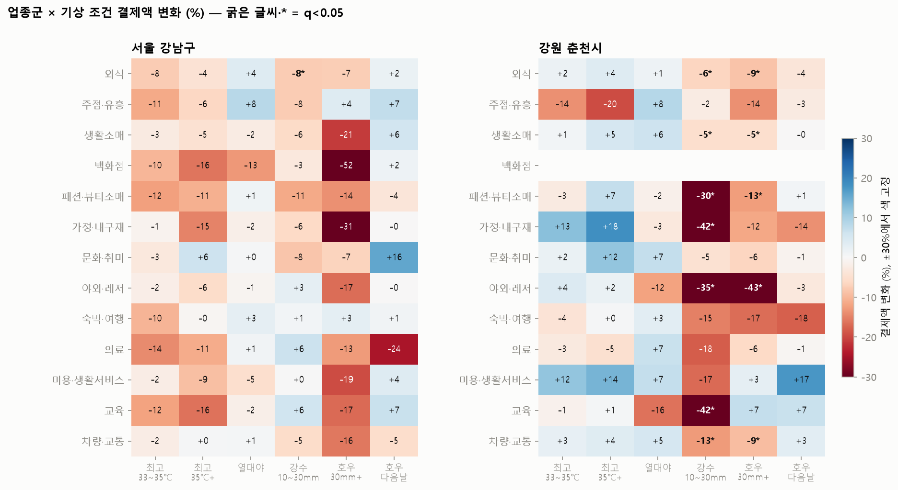

# 업종군 단위 폭염·호우 효과

업종군 정의: `scripts/common.py`의 `INDUSTRY_GROUPS` (13개 군). 모형: `scripts/weather_models.py` (주 고정효과·요일·공휴일 통제, HAC 표준오차). 이번 모형부터 **열대야(일최저 25℃ 이상)** 를 추가했다.

## 1. 강남 업종 제외 기준 민감도

**서울 강남구** (* p<0.05)

|              | 기본(13개 제외)   | +컴퓨터·쇼핑몰   | +ZZ_나머지   | 기본, 결제건수   | ZZ_나머지만, 결제건수   |
|:-------------|:-------------|:-----------|:----------|:-----------|:----------------|
| 최고 30~33℃    | -7.4%*       | -6.8%*     | -2.4%     | -2.3%      | +4.7%           |
| 최고 33~35℃    | -7.5%        | -7.1%*     | -6.4%     | -1.8%      | -0.0%           |
| 최고 35℃+      | -7.2%        | -5.5%      | -0.7%     | -2.4%      | +2.8%           |
| 열대야(최저 25℃+) | +0.0%        | -0.5%      | -4.7%     | -0.6%      | -2.0%           |
| 강수 0.1~10mm  | -2.9%*       | -2.1%      | -3.0%     | -2.9%*     | +0.7%           |
| 강수 10~30mm   | -2.4%        | -1.8%      | +0.2%     | -5.6%*     | +0.2%           |
| 호우(30mm+)    | -14.0%       | -10.0%     | -17.0%    | -15.3%     | -10.0%*         |
| 호우 다음날       | -1.1%        | -1.0%      | -1.8%     | +1.9%      | -3.8%           |

**강원 춘천시** (* p<0.05)

|              | 기본(13개 제외)   | +컴퓨터·쇼핑몰   | +ZZ_나머지   | 기본, 결제건수   | ZZ_나머지만, 결제건수   |
|:-------------|:-------------|:-----------|:----------|:-----------|:----------------|
| 최고 30~33℃    | +0.3%        | +0.3%      | -6.9%     | +2.1%      | -0.7%           |
| 최고 33~35℃    | +1.5%        | +1.5%      | -9.6%     | +1.8%      | +4.1%           |
| 최고 35℃+      | +3.8%*       | +3.9%*     | +4.1%     | +4.8%*     | -0.0%           |
| 열대야(최저 25℃+) | +2.7%*       | +2.7%*     | +9.3%     | +1.4%*     | +1.3%           |
| 강수 0.1~10mm  | -1.9%        | -1.9%      | -3.0%     | -3.0%*     | -4.6%*          |
| 강수 10~30mm   | -11.9%*      | -11.9%*    | -10.2%    | -10.9%*    | -12.6%*         |
| 호우(30mm+)    | -7.6%*       | -7.6%*     | -3.2%     | -10.4%*    | -8.5%*          |
| 호우 다음날       | -0.7%        | -0.7%      | +3.7%     | -1.2%      | +1.8%           |

## 2. 업종군별 효과

**서울 강남구 유의한 업종군 효과 (q<0.05)**

| group   | 항목         | 변화율   | 하한     | 상한    |   일수 | 매출비중   |
|:--------|:-----------|:------|:-------|:------|-----:|:-------|
| 외식      | 강수 10~30mm | -7.6% | -11.2% | -3.9% |   12 | 19.1%  |

**강원 춘천시 유의한 업종군 효과 (q<0.05)**

| group   | 항목         | 변화율    | 하한     | 상한     |   일수 | 매출비중   |
|:--------|:-----------|:-------|:-------|:-------|-----:|:-------|
| 야외·레저   | 호우(30mm+)  | -43.0% | -49.2% | -36.0% |   17 | 4.9%   |
| 가정·내구재  | 강수 10~30mm | -42.2% | -63.6% | -8.2%  |    9 | 2.0%   |
| 교육      | 강수 10~30mm | -41.5% | -60.7% | -13.0% |    9 | 2.8%   |
| 야외·레저   | 강수 10~30mm | -34.8% | -46.2% | -20.9% |    9 | 4.9%   |
| 패션·뷰티소매 | 강수 10~30mm | -30.3% | -43.5% | -14.0% |    9 | 2.3%   |
| 차량·교통   | 강수 10~30mm | -12.7% | -19.0% | -6.0%  |    9 | 12.2%  |
| 패션·뷰티소매 | 호우(30mm+)  | -12.6% | -20.0% | -4.6%  |   17 | 2.3%   |
| 차량·교통   | 호우(30mm+)  | -9.2%  | -12.6% | -5.7%  |   17 | 12.2%  |
| 외식      | 호우(30mm+)  | -8.5%  | -13.8% | -2.8%  |   17 | 26.2%  |
| 외식      | 강수 10~30mm | -6.5%  | -10.5% | -2.3%  |    9 | 26.2%  |
| 생활소매    | 강수 10~30mm | -5.1%  | -9.3%  | -0.7%  |    9 | 30.2%  |
| 생활소매    | 호우(30mm+)  | -5.0%  | -8.4%  | -1.5%  |   17 | 30.2%  |
