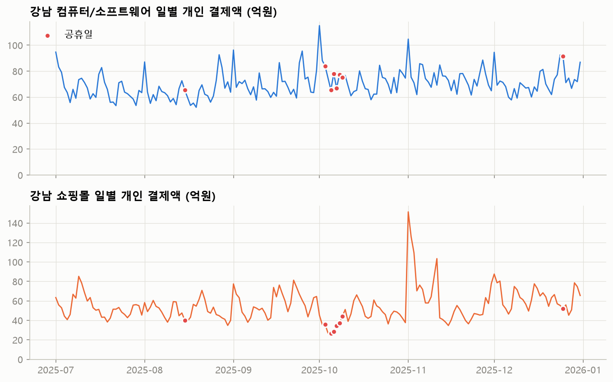
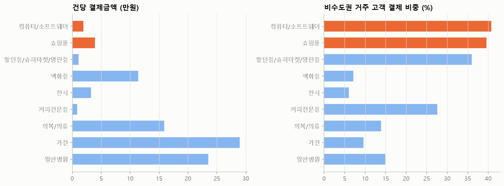

# 강남 '컴퓨터/소프트웨어'·'쇼핑몰' 업종 점검

데이터 레이아웃상 카드 데이터는 **오프라인 결제건 한정**이다. 따라서 온라인 결제 여부가 아니라 '강남구 지역 상권의 매장 매출로 볼 수 있는가'를 일반 상권 업종과 비교해 판단한다.

## 1. 행태 지표 비교 (강남, 개인 결제)

|              |   결제액 비중 |   건당금액(만원) |   00~05시 비중 |   18~23시 비중 |   일요일/평일 |   공휴일/평일 |   일매출 변동계수 |   최대일/중앙값 |
|:-------------|---------:|-----------:|------------:|------------:|---------:|---------:|-----------:|----------:|
| 컴퓨터/소프트웨어    |    0.046 |      1.914 |       0.16  |       0.326 |    0.847 |    1.048 |      0.147 |     1.681 |
| 쇼핑몰          |    0.036 |      3.916 |       0.068 |       0.328 |    0.916 |    0.64  |      0.293 |     2.883 |
| 할인점/슈퍼마켓/양판점 |    0.039 |      1.107 |       0.001 |       0.327 |    1.282 |    1.155 |      0.162 |     1.513 |
| 백화점          |    0.019 |     11.412 |       0     |       0.233 |    1.374 |    1.102 |      0.288 |     2.002 |
| 한식           |    0.024 |      3.254 |       0.048 |       0.482 |    0.766 |    0.683 |      0.157 |     1.401 |
| 커피전문점        |    0.013 |      0.853 |       0.001 |       0.182 |    1.025 |    1.067 |      0.097 |     1.284 |
| 의복/의류        |    0.015 |     15.9   |       0.001 |       0.213 |    1.276 |    1.01  |      0.337 |     3.512 |
| 가전           |    0.001 |     28.922 |       0     |       0.186 |    1.114 |    0.59  |      0.396 |     2.598 |
| 일반병원         |    0.054 |     23.515 |       0     |       0.068 |    0.047 |    0.377 |      0.471 |     2.327 |

같은 지표, 춘천:

|              |   결제액 비중 |   건당금액(만원) |   00~05시 비중 |   18~23시 비중 |   일요일/평일 |   공휴일/평일 |   일매출 변동계수 |   최대일/중앙값 |
|:-------------|---------:|-----------:|------------:|------------:|---------:|---------:|-----------:|----------:|
| 컴퓨터/소프트웨어    |    0     |     11.833 |       0     |       0.129 |    0.167 |    0.343 |      0.984 |     6.202 |
| 쇼핑몰          |    0     |      7.69  |       0     |       0     |  nan     |  nan     |      1.076 |     6.97  |
| 할인점/슈퍼마켓/양판점 |    0.119 |      3.515 |       0     |       0.266 |    1.066 |    1.411 |      0.265 |     2.397 |
| 한식           |    0.11  |      4.073 |       0.025 |       0.484 |    1.211 |    1.491 |      0.225 |     1.672 |
| 커피전문점        |    0.008 |      0.752 |       0.001 |       0.196 |    1.223 |    1.353 |      0.172 |     1.461 |
| 의복/의류        |    0.008 |      7.822 |       0.001 |       0.171 |    1.184 |    1.243 |      0.349 |     2.475 |
| 가전           |    0.006 |     25.695 |       0     |       0.13  |    0.844 |    0.674 |      0.605 |     5.726 |
| 일반병원         |    0.033 |      4.699 |       0.001 |       0.047 |    0.115 |    0.131 |      0.453 |     1.602 |

## 2. 고객 거주지 구성 (데이터2)

| MCT_RY_CD    |    서울 |   수도권(서울·경기·인천) |   비수도권 |
|:-------------|------:|----------------:|-------:|
| 컴퓨터/소프트웨어    | 0.219 |           0.592 |  0.408 |
| 쇼핑몰          | 0.267 |           0.604 |  0.396 |
| 할인점/슈퍼마켓/양판점 | 0.322 |           0.64  |  0.36  |
| 백화점          | 0.71  |           0.929 |  0.071 |
| 한식           | 0.67  |           0.94  |  0.06  |
| 커피전문점        | 0.372 |           0.724 |  0.276 |
| 의복/의류        | 0.574 |           0.861 |  0.139 |
| 가전           | 0.647 |           0.904 |  0.096 |
| 일반병원         | 0.54  |           0.851 |  0.149 |

## 3. 매출 급등일 (강남)

**컴퓨터/소프트웨어** 상위 5일 (결제액 억원)

| date             |   결제액(억) |   USE_CNT |   건당(만원) |   중앙값 대비 |
|:-----------------|---------:|----------:|---------:|---------:|
| 2025-10-01 (Wed) |    115.1 |    455875 |     2.52 |     1.68 |
| 2025-11-01 (Sat) |    104.7 |    465663 |     2.25 |     1.53 |
| 2025-09-01 (Mon) |     96.3 |    423270 |     2.27 |     1.41 |
| 2025-09-25 (Thu) |     95.5 |    419035 |     2.28 |     1.39 |
| 2025-07-01 (Tue) |     94.7 |    392328 |     2.41 |     1.38 |

**쇼핑몰** 상위 5일 (결제액 억원)

| date             |   결제액(억) |   USE_CNT |   건당(만원) |   중앙값 대비 |
|:-----------------|---------:|----------:|---------:|---------:|
| 2025-11-01 (Sat) |    151.4 |    218398 |     6.93 |     2.88 |
| 2025-11-02 (Sun) |    126   |    208163 |     6.05 |     2.4  |
| 2025-11-03 (Mon) |    109.4 |    204841 |     5.34 |     2.08 |
| 2025-11-11 (Tue) |    103.4 |    229017 |     4.52 |     1.97 |
| 2025-12-01 (Mon) |     87.5 |    178439 |     4.91 |     1.67 |

주황 = 점검 대상, 파랑 = 비교용 매장형 업종

## 4. 연령 구성 (강남)

| MCT_RY_CD    |   10 대 |   20 대 |   30 대 |   40 대 |   50 대 |   60 대 |   70 대 |   80 대 |   90 대 |
|:-------------|-------:|-------:|-------:|-------:|-------:|-------:|-------:|-------:|-------:|
| 컴퓨터/소프트웨어    |  0.006 |  0.105 |  0.357 |  0.336 |  0.161 |  0.027 |  0.006 |  0.001 |  0     |
| 쇼핑몰          |  0.002 |  0.042 |  0.177 |  0.356 |  0.281 |  0.108 |  0.029 |  0.005 |  0     |
| 할인점/슈퍼마켓/양판점 |  0.003 |  0.092 |  0.209 |  0.272 |  0.23  |  0.131 |  0.05  |  0.011 |  0.001 |
| 백화점          |  0.002 |  0.073 |  0.245 |  0.279 |  0.217 |  0.118 |  0.044 |  0.019 |  0.003 |
| 한식           |  0.006 |  0.127 |  0.27  |  0.226 |  0.196 |  0.107 |  0.049 |  0.017 |  0.002 |
| 커피전문점        |  0.01  |  0.157 |  0.294 |  0.236 |  0.191 |  0.085 |  0.023 |  0.005 |  0     |
| 의복/의류        |  0.004 |  0.121 |  0.318 |  0.247 |  0.167 |  0.1   |  0.035 |  0.007 |  0     |
| 가전           |  0.001 |  0.061 |  0.244 |  0.22  |  0.216 |  0.153 |  0.075 |  0.028 |  0.003 |
| 일반병원         |  0.002 |  0.123 |  0.242 |  0.238 |  0.223 |  0.116 |  0.042 |  0.013 |  0.002 |

## 5. 판단

| 근거 | 컴퓨터/소프트웨어 | 쇼핑몰 | 매장형 업종 |
|---|---|---|---|
| 00~05시 결제 비중 | 16% | 7% | 0~5% (한식 4.8%) |
| 공휴일/평일 | 1.05 (휴일에도 그대로) | 0.64 | 1.0~1.2 (유통) |
| 비수도권 고객 비중 | 41% | 40% | 6~15% (백화점·한식·의류·병원) |
| 급등일 | 매월 1일 (7/1, 9/1, 10/1, 11/1) | 11/1~3, 11/11 할인행사 기간 | 공휴일·주말 |
| 하루 결제건수 | 약 40만~47만 건 | 약 20만 건 | - |

- **컴퓨터/소프트웨어**: 새벽 결제, 매월 1일 급등, 전국 고객 구성 → 정기결제·구독형 과금이
  강남 소재 사업자 기준으로 집계된 것으로 판단. 지역 상권 매출이 아님.
- **쇼핑몰**: 대형 할인행사 기간 급등, 공휴일 감소, 전국 고객 구성 → 통신판매형 사업자의
  결제로 판단. 지역 상권 매출이 아님.
- 결론: 두 업종을 상권 분석에서 **제외**한다 (`scripts/common.py`의 `NON_COMMERCE`에 추가).
- 참고: 강남 '할인점/슈퍼마켓/양판점'(비수도권 36%)과 '커피전문점'(28%)도 외지 고객 비중이 높지만
  새벽 결제가 거의 없고 주말·공휴일 패턴이 매장형이라 유지한다. 체인 본사 집계가 일부 섞였을 수 있어
  해석 시 유의.
