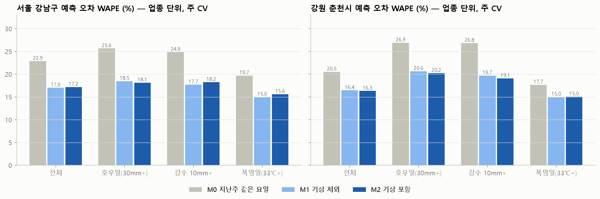
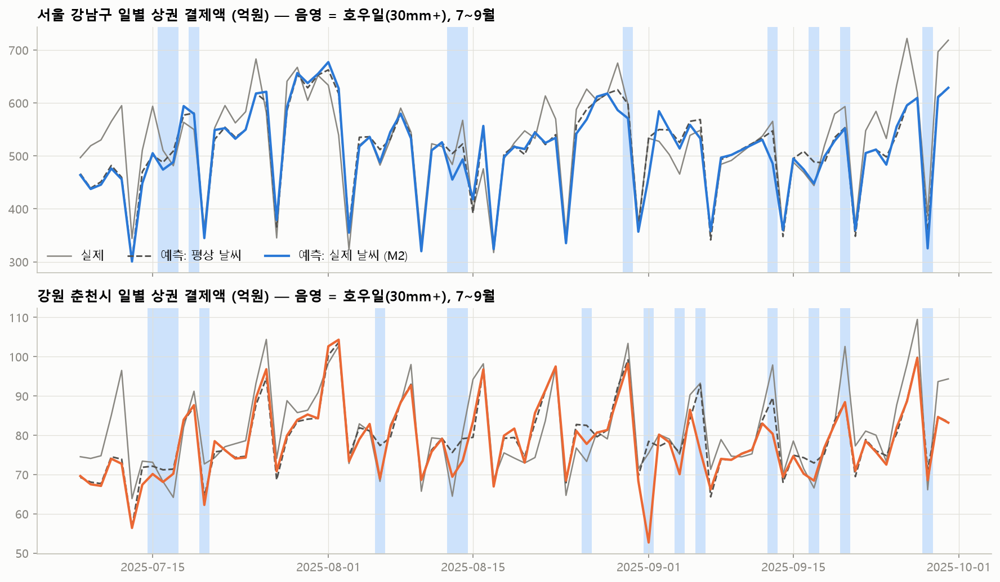
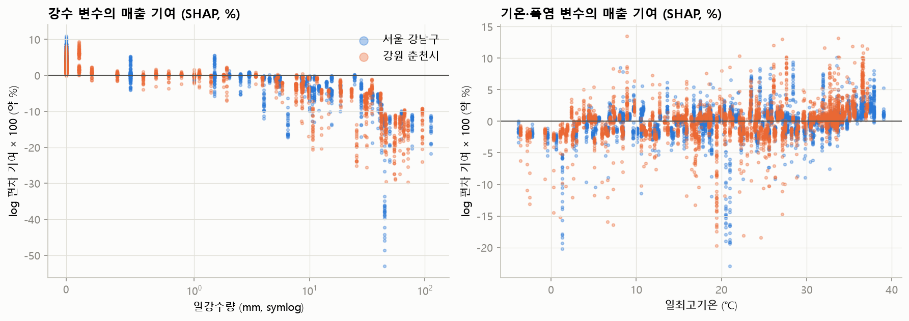

# 기상 기반 매출 예측 · 피해 추정 · 피해 경보 모델

방법은 `scripts/predict_damage.py` 상단 주석 참고.

- 업종 단위: 116개 지역×업종, 20,396행
- 업종군 단위: 25개 지역×업종군, 4,399행

## 1. 예측 성능 (WAPE, 낮을수록 좋음)

두 지역 합산. M2−M1이 음수면 기상 변수가 오차를 줄인 것.

|                            | M0 지난주 같은 요일   | M1 기상 제외   | M2 기상 포함   |   M2−M1 (%p) |
|:---------------------------|:---------------|:-----------|:-----------|-------------:|
| ('업종·주 CV', '전체')          | 22.5%          | 16.9%      | 17.1%      |         0.13 |
| ('업종·주 CV', '호우일(30mm+)')  | 25.9%          | 18.9%      | 18.6%      |        -0.37 |
| ('업종·주 CV', '강수 10mm+')    | 25.1%          | 18.0%      | 18.3%      |         0.39 |
| ('업종·주 CV', '폭염일(33℃+)')   | 19.5%          | 15.0%      | 15.5%      |         0.54 |
| ('업종·월 CV', '전체')          | 22.5%          | 17.5%      | 17.9%      |         0.4  |
| ('업종·월 CV', '호우일(30mm+)')  | 25.9%          | 19.2%      | 20.1%      |         0.95 |
| ('업종·월 CV', '강수 10mm+')    | 25.1%          | 18.9%      | 20.3%      |         1.4  |
| ('업종·월 CV', '폭염일(33℃+)')   | 19.5%          | 16.8%      | 16.8%      |        -0    |
| ('업종군·주 CV', '전체')         | 17.6%          | 13.8%      | 13.7%      |        -0.07 |
| ('업종군·주 CV', '호우일(30mm+)') | 21.7%          | 17.5%      | 17.2%      |        -0.3  |
| ('업종군·주 CV', '강수 10mm+')   | 20.2%          | 15.1%      | 15.3%      |         0.23 |
| ('업종군·주 CV', '폭염일(33℃+)')  | 15.1%          | 11.6%      | 11.6%      |        -0.06 |
| ('업종군·월 CV', '전체')         | 17.6%          | 13.6%      | 13.9%      |         0.31 |
| ('업종군·월 CV', '호우일(30mm+)') | 21.7%          | 18.8%      | 20.8%      |         2.05 |
| ('업종군·월 CV', '강수 10mm+')   | 20.2%          | 16.5%      | 17.6%      |         1.13 |
| ('업종군·월 CV', '폭염일(33℃+)')  | 15.1%          | 11.2%      | 11.1%      |        -0.12 |

지역별 (업종 단위 · 주 CV):

|                          | M0 지난주 같은 요일   | M1 기상 제외   | M2 기상 포함   |   M2−M1 (%p) |
|:-------------------------|:---------------|:-----------|:-----------|-------------:|
| ('서울 강남구', '전체')         | 22.9%          | 17.0%      | 17.2%      |         0.17 |
| ('서울 강남구', '호우일(30mm+)') | 25.6%          | 18.5%      | 18.1%      |        -0.35 |
| ('서울 강남구', '강수 10mm+')   | 24.9%          | 17.7%      | 18.2%      |         0.55 |
| ('서울 강남구', '폭염일(33℃+)')  | 19.7%          | 15.0%      | 15.6%      |         0.6  |
| ('강원 춘천시', '전체')         | 20.5%          | 16.4%      | 16.3%      |        -0.14 |
| ('강원 춘천시', '호우일(30mm+)') | 26.9%          | 20.6%      | 20.2%      |        -0.45 |
| ('강원 춘천시', '강수 10mm+')   | 26.8%          | 19.7%      | 19.1%      |        -0.63 |
| ('강원 춘천시', '폭염일(33℃+)')  | 17.7%          | 15.0%      | 15.0%      |         0.04 |

## 2. 반사실 피해 추정 (업종 단위 M2, 주 CV 예측: 실제 날씨 − 평상 날씨)

| 지역     | 조건         |   발생일수 |   1일 평균 손실(억) | 1일 평균 손실률   |   기간 합계 손실(억) |
|:-------|:-----------|-------:|--------------:|:------------|--------------:|
| 서울 강남구 | 호우일(30mm+) |     11 |         25.93 | +5.3%       |        285.21 |
| 서울 강남구 | 강수 10~30mm |     14 |         21.13 | +4.3%       |        295.85 |
| 서울 강남구 | 폭염일(33℃+)  |     38 |          0.47 | +0.1%       |         17.68 |
| 서울 강남구 | 열대야        |     35 |          1.56 | +0.3%       |         54.57 |
| 강원 춘천시 | 호우일(30mm+) |     18 |          6.21 | +7.7%       |        111.78 |
| 강원 춘천시 | 강수 10~30mm |      8 |          2.28 | +3.2%       |         18.23 |
| 강원 춘천시 | 폭염일(33℃+)  |     28 |         -0.19 | -0.2%       |         -5.45 |
| 강원 춘천시 | 열대야        |      3 |          0.23 | +0.2%       |          0.7  |

손실(+)은 평상 날씨였다면 더 많았을 매출. 조건이 겹치는 날(예: 폭염+열대야)은 각 행에 중복 집계됨.

**두 방법 비교 — 2025 하반기 호우 손실 (업종군별)**: ML 반사실(호우 30mm+ 당일) vs 회귀 기반 취약도 지수(`호우_2025실제`, 30mm+ 당일·10~30mm·다음날 포함)

- 서울 강남구: 업종군 순위 스피어만 상관 0.77 | ML 합계 285억, 회귀 합계 471억
- 강원 춘천시: 업종군 순위 스피어만 상관 0.76 | ML 합계 112억, 회귀 합계 179억

## 3. 피해 경보 분류 모델 (업종 단위, 주 CV)

라벨: 실제 결제액이 기상 외 요인 예상치(M1, 교차검증 예측) 대비 10% 이상 낮은 날 = 1. 입력: 예보로 알 수 있는 기상 + 달력 + 업종·지역.

| 지역     | 구간        |    표본 |   양성비율 |   AUC 기상 제외 |   PR-AUC 기상 제외 |   AUC 기상 포함 |   PR-AUC 기상 포함 |
|:-------|:----------|------:|-------:|------------:|---------------:|------------:|---------------:|
| 서울 강남구 | 전체        | 10496 |  0.295 |       0.65  |          0.396 |       0.649 |          0.401 |
| 서울 강남구 | 강수 10mm+  |  1499 |  0.368 |       0.618 |          0.463 |       0.599 |          0.45  |
| 서울 강남구 | 폭염일(33℃+) |  2278 |  0.28  |       0.661 |          0.394 |       0.643 |          0.386 |
| 강원 춘천시 | 전체        |  9900 |  0.328 |       0.629 |          0.4   |       0.642 |          0.437 |
| 강원 춘천시 | 강수 10mm+  |  1451 |  0.44  |       0.608 |          0.519 |       0.615 |          0.53  |
| 강원 춘천시 | 폭염일(33℃+) |  1568 |  0.303 |       0.623 |          0.36  |       0.61  |          0.36  |
| 전체     | 전체        | 20396 |  0.311 |       0.641 |          0.399 |       0.647 |          0.42  |
| 전체     | 강수 10mm+  |  2950 |  0.403 |       0.619 |          0.495 |       0.613 |          0.497 |
| 전체     | 폭염일(33℃+) |  3846 |  0.289 |       0.648 |          0.379 |       0.63  |          0.374 |

PR-AUC는 양성비율(무작위 분류 시 기대값)과 비교해 읽는다.

## 4. 기상 변수 기여도 (업종 단위 전체 데이터로 학습한 M2의 SHAP)

평균 |SHAP| (log 결제액 편차 단위, 0.01 ≈ 1%):

|           |   강원 춘천시 |   서울 강남구 |
|:----------|---------:|---------:|
| tmax_anom |   0.018  |   0.0155 |
| heat33    |   0.0005 |   0.0006 |
| heat35    |   0.0003 |   0.0003 |
| heat_run  |   0.0007 |   0.001  |
| tropical  |   0.0001 |   0.0003 |
| rain      |   0.0218 |   0.0191 |
| rain_hmax |   0.0112 |   0.0137 |
| rain_lag1 |   0.0117 |   0.0123 |
| lag7_rel  |   0.109  |   0.1006 |
| roll7_rel |   0.0546 |   0.0418 |
| dow       |   0.055  |   0.0532 |
| holiday   |   0.0366 |   0.0453 |

SHAP는 전체 기간 평균 예측 대비 기여도라 '평상 날씨 대비 손실'(2절 반사실 추정)과 크기가 다르다. 변수별 상대적 중요도와 반응 모양을 보는 용도로만 쓴다.

