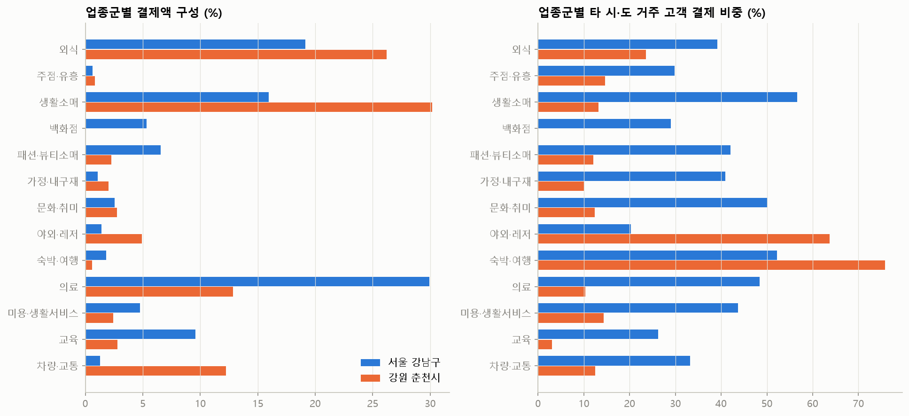
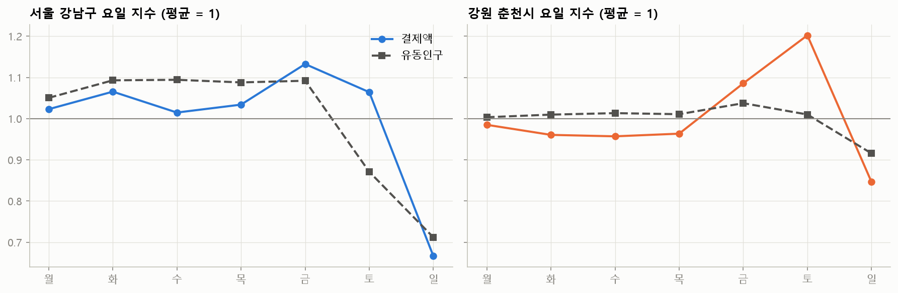

# 지역 특성 프로파일 — 강남구 vs 춘천시

## 1. 제공 데이터 기반 지표

카드: 신한카드 개인 결제·상권 업종(비상권 13개 업종 제외), 2025-07~12. 유동인구: SK 월별 일평균, 격자 합계.

|                        | 서울 강남구   | 강원 춘천시   |
|:-----------------------|:---------|:---------|
| 일평균 상권 결제액(억원)         | 539      | 84       |
| 주말/평일 결제액 비            | 0.83     | 1.04     |
| 야간(18~23시) 결제 비중       | 23.4%    | 26.9%    |
| 60대 이상 고객 결제 비중        | 16.5%    | 22.3%    |
| 타 시·도 거주 고객 결제 비중      | 43.5%    | 18.0%    |
| 외식 비중                  | 19.1%    | 26.2%    |
| 생활소매 비중                | 16.0%    | 30.2%    |
| 의료 비중                  | 29.9%    | 12.8%    |
| 야외·레저 + 차량·교통 비중       | 2.7%     | 17.1%    |
| 폭염일(최고 33℃+, 2025 하반기) | 43       | 30       |
| 열대야일(최저 25℃+)          | 42       | 5        |
| 호우일(30mm+)             | 11       | 18       |
| 유동인구 60대 이상 비중         | 18.9%    | 24.7%    |
| 유동인구 주말/평일 비           | 0.73     | 0.95     |
| 유동인구 야간(18~23시) 비중     | 25.8%    | 25.5%    |
| 유동인구 집계 격자 수(월평균)      | 15,351   | 83,968   |

## 2. 지역 유형 해석

| | 서울 강남구 | 강원 춘천시 |
|---|---|---|
| 상권 성격 | 평일 업무·의료·광역 소비 중심지 | 거주민 생활 상권 + 주말 관광·여가 |
| 근거 | 주말 결제·유동이 평일보다 낮음, 타 시·도 고객 비중 높음, 의료 비중 큼 | 토요일 결제 최고, 강원 거주 고객이 대부분, 생활소매·외식·차량 비중 큼 |
| 이동 방식(추정) | 대중교통·지하 연결 공간 비중이 큼 | 자차 이동, 야외 여가(골프·레저) 비중 큼 |
| 날씨 민감도(회귀 결과) | 업종별 신호가 약함 (외식만 비에 유의하게 감소) | 호우 시 야외·레저, 패션, 차량, 외식, 생활소매 유의하게 감소 |

- 강남은 외지 고객과 업무 목적 소비 비중이 커서 소비가 날씨에 따라 미뤄지거나 취소되기 어렵다.
  지하상가·대형 실내 시설이 많은 구조도 날씨 영향을 완충하는 것으로 보인다.
- 춘천은 소비가 거주민의 자차 이동과 야외 여가에 기대고 있어, 비가 오면 외출 자체가 줄면서 매출이 바로 감소한다.
- 그래서 **같은 날씨라도 지역 유형에 따라 피해가 다르게 나타난다**. 취약도 지수는 지역별로 따로 계산하고,
  '외지 고객 의존도'와 '야외·이동형 업종 비중'을 지역 특성 변수로 반영한다.

## 3. 외부 참고 자료 (공개 자료, 맥락 설명용)

- 2025년은 연평균기온 13.7℃로 관측 이래 두 번째로 더운 해였고, 여름철 전국 평균기온 25.7℃는 역대 1위였다
  (기상청 '2025년 기후특성' 보도 인용 기사: [베지뉴스](https://www.vegannews.co.kr/news/article.html?no=381333),
  [헤럴드경제](https://www.heraldk.com/article/2026010517011401751)).
- 서울의 2025년 여름 열대야는 46일로 역대 1위로 보도되었다. 서울 열대야 평년값(1991~2020)은 연 12.5일이다
  ([Korea JoongAng Daily](https://www.koreajoongangdaily.com/korea/no-relief-even-after-dark-record-tropical-nights-add-to-koreas-heat-crisis/12810767)).
- 2025년 7월 16~20일 전국 집중호우(호우 긴급재난문자 161건), 8월 13일 수도권 시간당 100mm 극한호우가 있었다
  ([서울신문](https://m.seoul.co.kr/news/2025/08/13/20250813500194)).
- 강남구 사업체 수는 10만 7,804개(2022년 기준)로 서울 자치구 중 가장 많다
  ([강남구청 보도자료](https://www.gangnam.go.kr/board/B_000031/1073493/view.do?mid=ID01)).
- 춘천 원도심 상권은 명동·중앙시장(낭만시장)·닭갈비골목이 이어진 구조이고, 남춘천역 풍물시장은 5일장(2·7일)으로 운영된다
  ([서울신문 2010](https://m.go.seoul.co.kr/news/2010/04/30/20100430025034),
  [뉴스토마토](https://newstomato.com/ReadNews.aspx?no=782670)). 전통시장·5일장은 야외 노출형이라 호우에 취약할 가능성이 크다
  (카드 데이터는 시군구·업종 단위라 시장 단위로 직접 검증할 수는 없음).

※ 외부 자료는 지역 맥락 설명에만 쓰고, 모형 입력에는 제공 데이터와 기상청 관측자료만 사용했다.
