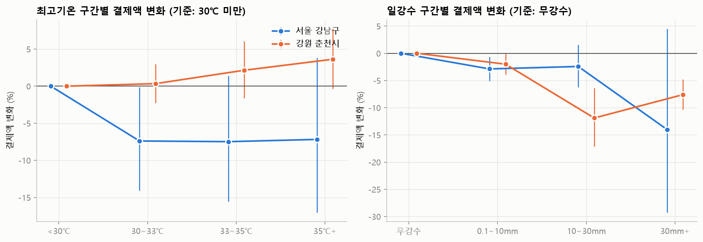
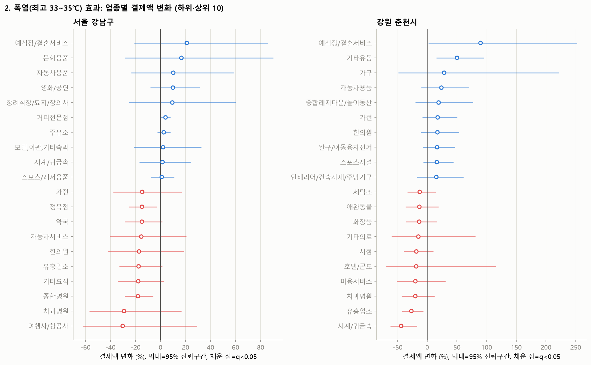
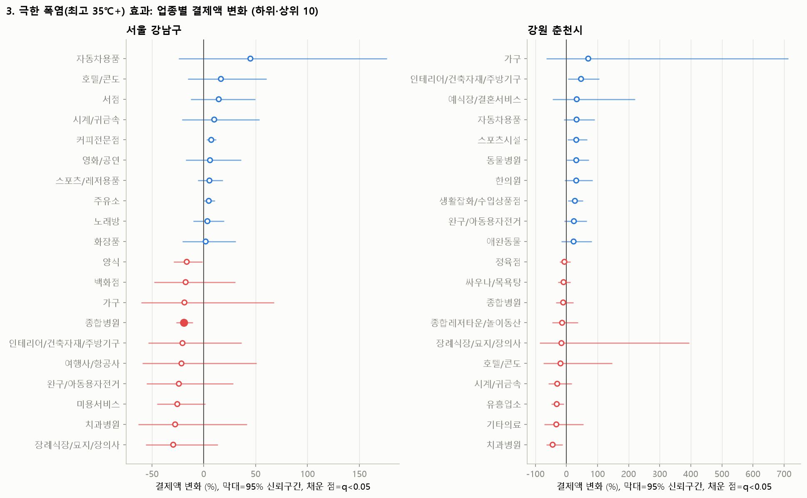
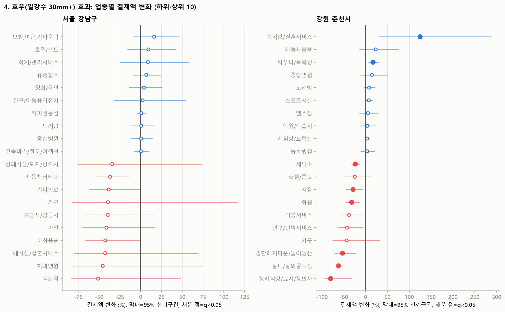
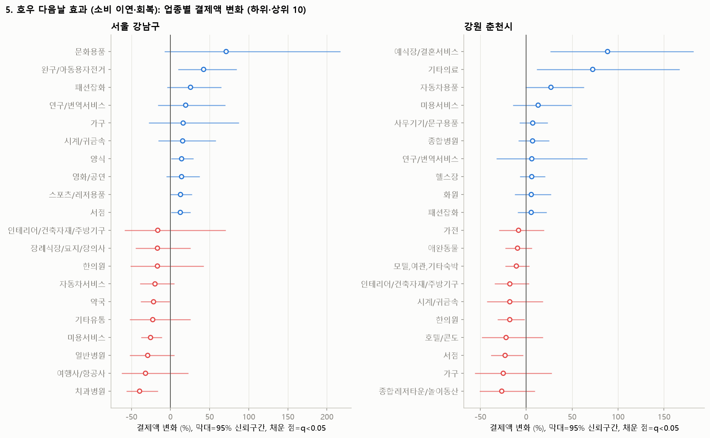
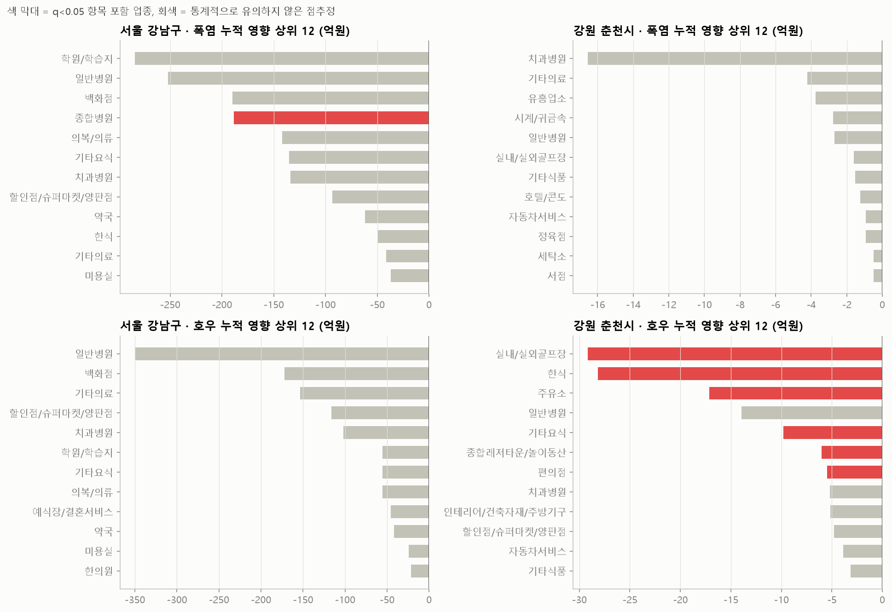
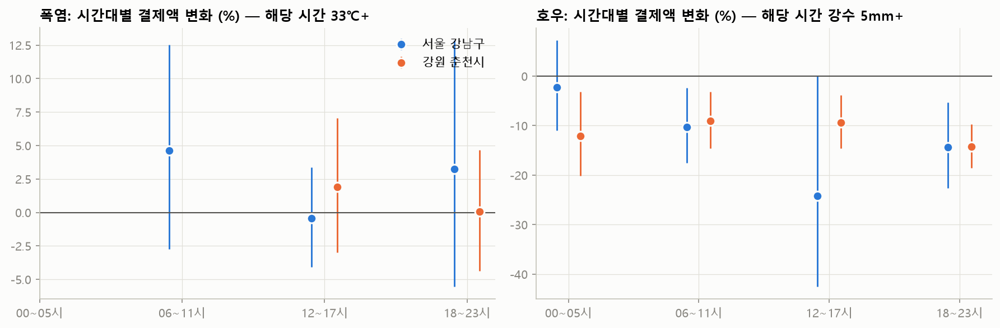

# 업종별 폭염·호우 효과 회귀분석

모형 설명은 `scripts/weather_regression.py` 상단 주석 참고. 변화율은 같은 주·같은 요일 조건에서 기준일(최고 30℃ 미만·무강수) 대비 결제액 변화.

- 분석 업종: 강남 60개, 춘천 56개 (거래일 175일 이상, 지역 상권 결제액 비중 0.1% 이상)
- 유의성 표기: q<0.05 (업종 간 다중검정 보정 후)

## 1. 전체 상권 효과 (구간별 반응)

|                | 강원 춘천시                 | 서울 강남구                 |
|:---------------|:-----------------------|:-----------------------|
| 최고 30~33℃      | +0.3% [-2.2%, +3.0%]   | -7.4% [-14.1%, -0.2%]  |
| 최고 33~35℃      | +2.1% [-1.6%, +6.1%]   | -7.5% [-15.6%, +1.4%]  |
| 최고 35℃+        | +3.6% [-0.3%, +7.8%]   | -7.2% [-17.0%, +3.8%]  |
| 강수 0.1~10mm    | -2.0% [-3.9%, -0.1%]   | -2.9% [-5.1%, -0.7%]   |
| 강수 10~30mm     | -11.9% [-17.1%, -6.3%] | -2.4% [-6.2%, +1.5%]   |
| 강수 30mm+ (호우일) | -7.6% [-10.4%, -4.8%]  | -14.0% [-29.3%, +4.5%] |
| 호우 다음날         | -0.7% [-4.4%, +3.2%]   | -1.1% [-8.7%, +7.1%]   |

대괄호는 95% 신뢰구간.

**강건성 점검 — 7~9월 표본만 사용** (폭염 계절 안에서만 비교)

| 항목             | 강원 춘천시               | 서울 강남구               |
|:---------------|:---------------------|:---------------------|
| 강수 30mm+ (호우일) | -6.3% [-9.1%, -3.4%] | -1.9% [-7.3%, +3.8%] |
| 최고 30~33℃      | +1.3% [-1.1%, +3.6%] | -4.6% [-7.7%, -1.3%] |
| 최고 33~35℃      | +2.9% [-0.8%, +6.7%] | -4.7% [-9.4%, +0.3%] |
| 최고 35℃+        | +5.1% [+0.9%, +9.4%] | -2.2% [-8.3%, +4.3%] |

## 2. 폭염(최고 33~35℃) 효과

**서울 강남구** — 유의한 업종 0개 / 60개 (해당 일수 25일)

**강원 춘천시** — 유의한 업종 1개 / 56개 (해당 일수 19일)

| 업종    | 변화율    | 하한    | 상한     |   q |   기준일매출(억) |   기간영향(억) |
|:------|:-------|:------|:-------|----:|-----------:|----------:|
| 커피전문점 | +13.4% | +8.1% | +18.9% |   0 |      0.829 |     2.104 |

## 3. 극한 폭염(최고 35℃+) 효과

**서울 강남구** — 유의한 업종 1개 / 60개 (해당 일수 18일)

| 업종   | 변화율    | 하한     | 상한     |     q |   기준일매출(억) |   기간영향(억) |
|:-----|:-------|:-------|:-------|------:|-----------:|----------:|
| 종합병원 | -19.0% | -26.7% | -10.4% | 0.002 |     23.744 |   -81.165 |

**강원 춘천시** — 유의한 업종 1개 / 56개 (해당 일수 11일)

| 업종    | 변화율    | 하한     | 상한     |   q |   기준일매출(억) |   기간영향(억) |
|:------|:-------|:-------|:-------|----:|-----------:|----------:|
| 커피전문점 | +19.6% | +12.6% | +27.1% |   0 |      0.829 |     1.791 |

## 4. 호우(일강수 30mm+) 효과

**서울 강남구** — 유의한 업종 1개 / 60개 (해당 일수 11일)

| 업종   | 변화율    | 하한     | 상한     |     q |   기준일매출(억) |   기간영향(억) |
|:-----|:-------|:-------|:-------|------:|-----------:|----------:|
| 농수산물 | -19.8% | -28.3% | -10.3% | 0.007 |      1.023 |    -2.225 |

**강원 춘천시** — 유의한 업종 17개 / 56개 (해당 일수 17일)

| 업종          | 변화율     | 하한     | 상한      |     q |   기준일매출(억) |   기간영향(억) |
|:------------|:--------|:-------|:--------|------:|-----------:|----------:|
| 장례식장/묘지/장의사 | -80.0%  | -94.2% | -30.6%  | 0.042 |      0.17  |    -2.17  |
| 실내/실외골프장    | -61.9%  | -70.9% | -50.1%  | 0     |      2.63  |   -27.683 |
| 종합레저타운/놀이동산 | -52.8%  | -71.4% | -22.2%  | 0.016 |      0.436 |    -3.91  |
| 화원          | -31.7%  | -46.2% | -13.1%  | 0.013 |      0.18  |    -0.97  |
| 서점          | -28.7%  | -45.7% | -6.4%   | 0.049 |      0.132 |    -0.644 |
| 세탁소         | -23.4%  | -32.4% | -13.2%  | 0     |      0.161 |    -0.639 |
| 애완동물        | -19.3%  | -27.7% | -9.9%   | 0.001 |      0.2   |    -0.656 |
| 완구/아동용자전거   | -18.4%  | -28.5% | -6.8%   | 0.016 |      0.084 |    -0.263 |
| 일식          | -15.5%  | -26.2% | -3.2%   | 0.049 |      0.852 |    -2.248 |
| 커피전문점       | -14.2%  | -19.5% | -8.6%   | 0     |      0.829 |    -2.005 |
| 주유소         | -12.7%  | -17.9% | -7.1%   | 0     |      7.489 |   -16.134 |
| 기타요식        | -9.4%   | -14.4% | -4.1%   | 0.006 |      4.692 |    -7.501 |
| 한식          | -8.8%   | -14.5% | -2.8%   | 0.021 |     11.85  |   -17.771 |
| 편의점         | -7.0%   | -10.0% | -4.0%   | 0     |      4.486 |    -5.353 |
| LPG가스       | -5.0%   | -8.3%  | -1.5%   | 0.022 |      1.209 |    -1.023 |
| 싸우나/목욕탕     | +17.2%  | +5.6%  | +30.0%  | 0.016 |      0.149 |     0.436 |
| 예식장/결혼서비스   | +124.8% | +30.3% | +288.0% | 0.017 |      0.399 |     8.472 |

## 5. 호우 다음날 효과 (소비 이연·회복)

**서울 강남구** — 유의한 업종 0개 / 60개 (해당 일수 11일)

**강원 춘천시** — 유의한 업종 0개 / 56개 (해당 일수 18일)

## 6. 기간 누적 영향액 (탐색용)

기간영향 = 기준 일매출 × 변화율 × 해당 일수. 신한카드 개인 결제 기준이며, 전체 시장 규모로 환산하지 않은 값.

|                  |   유의업종_합계_억 |   전업종_점추정합_억 |
|:-----------------|------------:|-------------:|
| ('강원 춘천시', '폭염') |         3.9 |         73.2 |
| ('강원 춘천시', '호우') |       -80.1 |       -123.7 |
| ('서울 강남구', '폭염') |       -81.2 |      -1758.8 |
| ('서울 강남구', '호우') |        -2.2 |      -1316.5 |

- **유의업종 합계**(q<0.05)를 1차 수치로 본다. 전업종 점추정합은 비유의 계수까지 더한 값이라 불확실성이 매우 크다 (특히 강남은 기준 매출이 큰 병원 업종의 노이즈가 지배).
- 호우는 당일(30mm+)과 다음날 효과를 더한 순효과.

## 7. 시간대별 효과 (모형 B)

각 6시간대의 결제액을 같은 시간대의 기상(시간대 내 최고기온 33℃+, 시간대 강수 합 5mm+)과 연결.

|                 | 강원 춘천시                        | 서울 강남구                        |
|:----------------|:------------------------------|:------------------------------|
| ('폭염', '06_11') | nan                           | +4.6% [-2.8%, +12.5%] (n=12)  |
| ('폭염', '12_17') | +1.9% [-3.0%, +7.1%] (n=24)   | -0.4% [-4.1%, +3.4%] (n=33)   |
| ('폭염', '18_23') | +0.0% [-4.4%, +4.7%] (n=11)   | +3.3% [-5.5%, +12.9%] (n=17)  |
| ('호우', '00_05') | -12.1% [-20.2%, -3.2%] (n=14) | -2.2% [-10.9%, +7.3%] (n=12)  |
| ('호우', '06_11') | -9.1% [-14.6%, -3.1%] (n=17)  | -10.3% [-17.6%, -2.4%] (n=12) |
| ('호우', '12_17') | -9.4% [-14.6%, -3.9%] (n=11)  | -24.2% [-42.5%, +0.0%] (n=7)  |
| ('호우', '18_23') | -14.3% [-18.6%, -9.7%] (n=14) | -14.4% [-22.7%, -5.3%] (n=13) |

업종별 시간대 계수 전체: `model_B_timeband_coefficients.csv`
