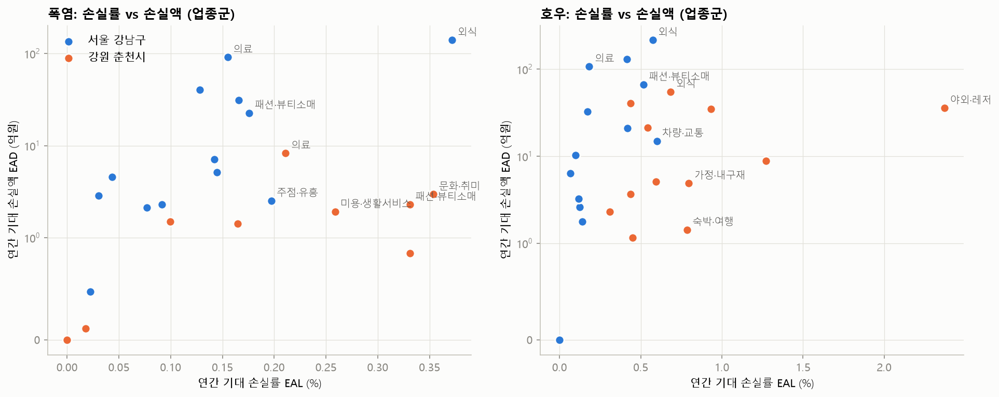
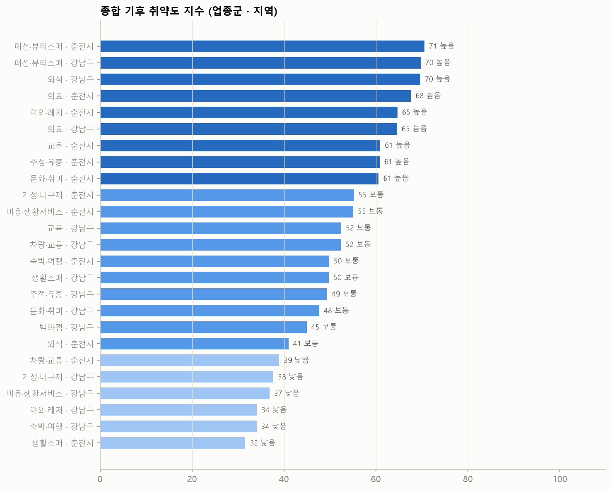

# 기후 취약도 지수

방법은 `scripts/vulnerability_index.py` 상단 주석 참고.

## 1. 노출: 조건별 연평균 발생 일수 (2015~2024, 기상청 강남 AWS 400 · 춘천 ASOS 101) vs 2025 하반기 실제

|              |   ('연평균(2015~2024)', '강원 춘천시') |   ('연평균(2015~2024)', '서울 강남구') |   ('2025-07~12 실제', '서울 강남구') |   ('2025-07~12 실제', '강원 춘천시') |
|:-------------|-------------------------------:|-------------------------------:|------------------------------:|------------------------------:|
| 최고 30~33℃    |                           35.3 |                           35.1 |                            18 |                            25 |
| 최고 33~35℃    |                           13.8 |                           15.9 |                            25 |                            19 |
| 최고 35℃+      |                            5.2 |                           10.9 |                            18 |                            11 |
| 강수 0.1~10mm  |                           70   |                           57.3 |                            34 |                            37 |
| 강수 10~30mm   |                           20.5 |                           19   |                            12 |                             9 |
| 호우(30mm+)    |                           12   |                           12.4 |                            11 |                            17 |
| 열대야(최저 25℃+) |                            8.8 |                           23.1 |                            42 |                             5 |
| 호우 다음날       |                           12   |                           12.4 |                            11 |                            18 |

2025년은 폭염·열대야가 평년보다 크게 많았던 해(특히 강남)라, 연간 기대값은 평년 빈도로 계산한다.

## 2. 업종군 취약도 (지역 × 업종군 26개 단위)

민감도는 0 중심 경험적 베이즈 축소(회의적 사전분포) 후 값. 축소계수 k가 0에 가까우면 해당 조건의 효과가 데이터로 뒷받침되지 않아 0으로 당겨진 것.

조건별 축소계수 중앙값 (1 = 원 추정 유지, 0 = 효과 없음으로 축소):

|              |   강원 춘천시 |   서울 강남구 |
|:-------------|---------:|---------:|
| 호우 다음날       |     0.32 |     0.14 |
| 강수 10~30mm   |     0.51 |     0.57 |
| 호우(30mm+)    |     0.81 |     0.3  |
| 최고 30~33℃    |     0.31 |     0.11 |
| 최고 33~35℃    |     0    |     0.07 |
| 최고 35℃+      |     0.04 |     0    |
| 열대야(최저 25℃+) |     0.27 |     0    |

| 지역     | 단위       |   종합_지수 | 종합_등급   |   지역내_순위 |   폭염_지수 |   호우_지수 | 폭염_EAL%   | 호우_EAL%   |   폭염_EAD(억/년) |   호우_EAD(억/년) |   호우_2025실제(억) |   폭염_2025실제(억) |
|:-------|:---------|--------:|:--------|---------:|--------:|--------:|:----------|:----------|--------------:|--------------:|---------------:|---------------:|
| 강원 춘천시 | 패션·뷰티소매  |    70.6 | 높음      |        1 |    71.8 |    69.3 | 0.33%     | 1.27%     |           2.3 |           8.8 |            6.4 |            1.6 |
| 서울 강남구 | 패션·뷰티소매  |    69.7 | 높음      |        1 |    72.6 |    66.8 | 0.18%     | 0.52%     |          22.7 |          66.6 |           47.7 |           16.8 |
| 서울 강남구 | 외식       |    69.6 | 높음      |        2 |    80.8 |    58.5 | 0.37%     | 0.57%     |         139.8 |         215.7 |          157.3 |          109.4 |
| 강원 춘천시 | 의료       |    67.6 | 높음      |        2 |    73.6 |    61.6 | 0.21%     | 0.54%     |           8.3 |          21.4 |           15.8 |            6.1 |
| 강원 춘천시 | 야외·레저    |    64.7 | 높음      |        3 |    44.4 |    85   | 0.10%     | 2.37%     |           1.5 |          35.7 |           33.9 |            0.9 |
| 서울 강남구 | 의료       |    64.6 | 높음      |        3 |    71.4 |    57.8 | 0.16%     | 0.18%     |          91.4 |         107.8 |           95.6 |           77.7 |
| 강원 춘천시 | 교육       |    61   | 높음      |        4 |    60.8 |    61.1 | 0.16%     | 0.60%     |           1.4 |           5.1 |            2.3 |            1   |
| 강원 춘천시 | 주점·유흥    |    60.8 | 높음      |        5 |    70.4 |    51.2 | 0.33%     | 0.45%     |           0.8 |           1.2 |            1.4 |            0.6 |
| 강원 춘천시 | 문화·취미    |    60.6 | 높음      |        6 |    75.2 |    46   | 0.35%     | 0.44%     |           3   |           3.7 |            3.3 |            2.1 |
| 강원 춘천시 | 가정·내구재   |    55.2 | 보통      |        7 |    32.8 |    77.6 | 0.02%     | 0.80%     |           0.1 |           4.9 |            4.1 |            0.1 |
| 강원 춘천시 | 미용·생활서비스 |    55   | 보통      |        8 |    72.2 |    37.9 | 0.26%     | 0.31%     |           1.9 |           2.3 |            1   |            1.4 |
| 서울 강남구 | 교육       |    52.5 | 보통      |        4 |    67.4 |    37.5 | 0.17%     | 0.17%     |          31.3 |          32.8 |           29.1 |           23   |
| 서울 강남구 | 차량·교통    |    52.4 | 보통      |        5 |    38.8 |    66   | 0.09%     | 0.60%     |           2.3 |          15   |           11.8 |            1.6 |
| 강원 춘천시 | 숙박·여행    |    49.8 | 보통      |        9 |    26.4 |    73.2 | 0.00%     | 0.79%     |           0   |           1.4 |            1.5 |            0   |
| 서울 강남구 | 생활소매     |    49.8 | 보통      |        6 |    53.4 |    46.1 | 0.13%     | 0.42%     |          40.3 |         130.7 |           95.2 |           29.4 |
| 서울 강남구 | 주점·유흥    |    49.4 | 보통      |        7 |    69.4 |    29.3 | 0.20%     | 0.14%     |           2.5 |           1.8 |            1.1 |            1.8 |
| 서울 강남구 | 문화·취미    |    47.6 | 보통      |        8 |    53.2 |    42.1 | 0.14%     | 0.42%     |           7.1 |          20.9 |           14.8 |            5.4 |
| 서울 강남구 | 백화점      |    45   | 보통      |        9 |    54.6 |    35.3 | 0.04%     | 0.10%     |           4.6 |          10.3 |            7.7 |            3.5 |
| 강원 춘천시 | 외식       |    41   | 보통      |       10 |     9.6 |    72.4 | 0.00%     | 0.68%     |           0   |          55   |           51   |            0   |
| 강원 춘천시 | 차량·교통    |    39   | 낮음      |       11 |    11.2 |    66.7 | 0.00%     | 0.93%     |           0   |          34.9 |           26.2 |            0   |
| 서울 강남구 | 가정·내구재   |    37.7 | 낮음      |       10 |    38.4 |    37   | 0.02%     | 0.12%     |           0.5 |           2.6 |            1.9 |            0.3 |
| 서울 강남구 | 미용·생활서비스 |    36.9 | 낮음      |       11 |    45.6 |    28.1 | 0.03%     | 0.07%     |           2.9 |           6.3 |            5.6 |            2   |
| 서울 강남구 | 야외·레저    |    34.1 | 낮음      |       12 |    39.6 |    28.6 | 0.08%     | 0.12%     |           2.1 |           3.2 |            2.9 |            1.3 |
| 서울 강남구 | 숙박·여행    |    34.1 | 낮음      |       13 |    56   |    12.1 | 0.14%     | 0.00%     |           5.1 |           0   |            0   |            3.8 |
| 강원 춘천시 | 생활소매     |    31.6 | 낮음      |       12 |    10.4 |    52.8 | 0.00%     | 0.44%     |           0   |          40.5 |           32.7 |            0   |

EAL% = 연간 매출 대비 기대 손실률, EAD = 연간 기대 손실액(신한카드 개인 결제 기준). 2025실제 = 2025 하반기 실제 발생 일수로 계산한 손실 추정.

## 3. 가중치 강건성

- 가중치를 무작위(디리클레)로 2,000번 바꿨을 때 기본 순위와의 스피어만 상관 중앙값: **0.74**
- 기본 상위 8개 단위의 순위 범위:

| 지역     | 단위      |   종합_지수 |   순위_중앙 |   순위_P10 |   순위_P90 |   상위5_확률 |
|:-------|:--------|--------:|--------:|---------:|---------:|---------:|
| 강원 춘천시 | 패션·뷰티소매 |   70.55 |       8 |      2   |     14   |     0.27 |
| 서울 강남구 | 패션·뷰티소매 |   69.7  |       2 |      2   |      6   |     0.88 |
| 서울 강남구 | 외식      |   69.65 |       8 |      1   |     20   |     0.41 |
| 강원 춘천시 | 의료      |   67.6  |       4 |      3   |     10   |     0.64 |
| 강원 춘천시 | 야외·레저   |   64.7  |       7 |      4   |     12   |     0.26 |
| 서울 강남구 | 의료      |   64.6  |       1 |      1   |      6   |     0.86 |
| 강원 춘천시 | 교육      |   60.95 |       8 |      3   |     14.1 |     0.28 |
| 강원 춘천시 | 주점·유흥   |   60.8  |      10 |      3.9 |     18   |     0.19 |

## 4. 업종 단위 취약도 상위 (지역별 10개)

**서울 강남구**

| 단위        | 업종군     |   종합_지수 | 종합_등급   | 폭염_EAL%   | 호우_EAL%   |   폭염_EAD(억/년) |   호우_EAD(억/년) |   호우_EAD_P5 |   호우_EAD_P95 |
|:----------|:--------|--------:|:--------|:----------|:----------|--------------:|--------------:|------------:|-------------:|
| 기타요식      | 외식      |   80.58 | 매우높음    | 0.20%     | 0.83%     |         16.1  |         65.98 |       34.12 |        97.73 |
| 의복/의류     | 패션·뷰티소매 |   79.18 | 높음      | 0.12%     | 0.73%     |         10.14 |         59.57 |       28.61 |        97.83 |
| 기타식품      | 생활소매    |   78.58 | 높음      | 0.21%     | 0.69%     |          2.71 |          9.06 |        3.79 |        14.97 |
| 농수산물      | 생활소매    |   75.82 | 높음      | 0.31%     | 0.63%     |          1.12 |          2.27 |        1.29 |         3.86 |
| 제과점       | 외식      |   74.53 | 높음      | 0.44%     | 0.56%     |          5.4  |          6.86 |        3.53 |        10.84 |
| 동물병원      | 의료      |   69.48 | 높음      | 0.18%     | 0.44%     |          1.11 |          2.78 |        0.65 |         5.9  |
| 약국        | 의료      |   66.47 | 높음      | 0.16%     | 0.18%     |          5.61 |          6.43 |        0.09 |        25.65 |
| 자동차서비스    | 차량·교통   |   66.47 | 높음      | 0.08%     | 0.45%     |          0.6  |          3.51 |        0.86 |         7.88 |
| 사무기기/문구용품 | 생활소매    |   65.75 | 높음      | 0.34%     | 0.27%     |          0.95 |          0.75 |        0.11 |         2.19 |
| 일식        | 외식      |   65.65 | 높음      | 0.22%     | 0.42%     |          5.96 |         11.59 |        3.82 |        21.19 |

**강원 춘천시**

| 단위       | 업종군     |   종합_지수 | 종합_등급   | 폭염_EAL%   | 호우_EAL%   |   폭염_EAD(억/년) |   호우_EAD(억/년) |   호우_EAD_P5 |   호우_EAD_P95 |
|:---------|:--------|--------:|:--------|:----------|:----------|--------------:|--------------:|------------:|-------------:|
| 실내/실외골프장 | 야외·레저   |   76.38 | 높음      | 0.08%     | 1.70%     |          0.75 |         16.1  |        8.93 |        23.41 |
| 일반병원     | 의료      |   73.28 | 높음      | 0.17%     | 0.52%     |          2.31 |          6.97 |        1.13 |        17.88 |
| 유흥업소     | 주점·유흥   |   70.28 | 높음      | 0.23%     | 0.56%     |          0.38 |          0.93 |        0.17 |         2.07 |
| 시계/귀금속   | 패션·뷰티소매 |   69.22 | 높음      | 0.13%     | 0.53%     |          0.1  |          0.43 |        0.05 |         1.17 |
| 애완동물     | 생활소매    |   67.33 | 높음      | 0.08%     | 1.27%     |          0.06 |          0.93 |        0.56 |         1.27 |
| 정육점      | 생활소매    |   67.16 | 높음      | 0.09%     | 0.76%     |          0.33 |          2.88 |        1.02 |         5.34 |
| 치과병원     | 의료      |   65.22 | 높음      | 0.12%     | 0.29%     |          0.76 |          1.89 |        0    |         9.94 |
| 화원       | 생활소매    |   64.78 | 높음      | 0.10%     | 0.94%     |          0.06 |          0.57 |        0.21 |         1    |
| 화장품      | 패션·뷰티소매 |   64.25 | 높음      | 0.08%     | 0.74%     |          0.05 |          0.49 |        0.09 |         0.98 |
| 자동차서비스   | 차량·교통   |   63.62 | 높음      | 0.09%     | 0.51%     |          0.45 |          2.7  |        0.53 |         7.31 |

## 5. 예보 기반 우선 지원 업종 선정 (시나리오)

예보 조건이 주어지면 업종별 `1일 예상 손실액 = 기준 일매출 × 축소 손실률`을 계산하고, 종합 취약도 등급과 함께 정렬한다. 우선순위 점수 = 0.6·r(예상 손실액) + 0.4·r(종합 지수).

**강원 춘천시 · 호우(30mm+) 예보 시 상위 8개 업종**

| 단위       | 손실률   |   1일 예상손실(백만원) | 종합_등급   |   우선순위점수 |
|:---------|:------|---------------:|:--------|---------:|
| 실내/실외골프장 | 28.0% |          73.67 | 높음      |     0.97 |
| 일반병원     | 8.4%  |          34.08 | 높음      |     0.94 |
| 한식       | 8.0%  |          94.75 | 높음      |     0.9  |
| 자동차서비스   | 9.6%  |          15.39 | 높음      |     0.82 |
| 치과병원     | 5.6%  |          10.59 | 높음      |     0.81 |
| 스포츠/레저용품 | 5.1%  |           9.73 | 높음      |     0.76 |
| 유흥업소     | 9.5%  |           4.18 | 높음      |     0.74 |
| 주유소      | 11.6% |          86.78 | 보통      |     0.7  |

**서울 강남구 · 호우(30mm+) 예보 시 상위 8개 업종**

| 단위           | 손실률   |   1일 예상손실(백만원) | 종합_등급   |   우선순위점수 |
|:-------------|:------|---------------:|:--------|---------:|
| 기타요식         | 10.8% |         242.6  | 매우높음    |     0.99 |
| 의복/의류        | 5.7%  |         133.79 | 높음      |     0.92 |
| 할인점/슈퍼마켓/양판점 | 3.7%  |         220.57 | 높음      |     0.89 |
| 기타식품         | 9.6%  |          37.49 | 높음      |     0.86 |
| 학원/학습지       | 5.3%  |         264.98 | 높음      |     0.86 |
| 일식           | 6.1%  |          46.74 | 높음      |     0.83 |
| 약국           | 2.8%  |          29.9  | 높음      |     0.82 |
| 제과점          | 7.8%  |          26.9  | 높음      |     0.81 |

**서울 강남구 · 최고 35℃+ 예보 시 상위 8개 업종**

| 단위           | 손실률   |   1일 예상손실(백만원) | 종합_등급   |   우선순위점수 |
|:-------------|:------|---------------:|:--------|---------:|
| 의복/의류        | 1.4%  |          33.46 | 높음      |     0.92 |
| 기타요식         | 1.2%  |          27.29 | 매우높음    |     0.91 |
| 할인점/슈퍼마켓/양판점 | 0.9%  |          55.63 | 높음      |     0.86 |
| 종합병원         | 7.2%  |         171.24 | 높음      |     0.85 |
| 약국           | 1.6%  |          16.5  | 높음      |     0.8  |
| 학원/학습지       | 1.8%  |          90.89 | 높음      |     0.79 |
| 제과점          | 4.1%  |          14.37 | 높음      |     0.79 |
| 양식           | 2.8%  |          21.39 | 높음      |     0.76 |

**강원 춘천시 · 최고 35℃+ 예보 시 상위 8개 업종**

| 단위     | 손실률   |   1일 예상손실(백만원) | 종합_등급   |   우선순위점수 |
|:-------|:------|---------------:|:--------|---------:|
| 유흥업소   | 5.6%  |           2.47 | 높음      |     0.85 |
| 치과병원   | 3.4%  |           6.41 | 높음      |     0.85 |
| 정육점    | 2.2%  |           2.36 | 높음      |     0.68 |
| 종합병원   | 1.7%  |           3.65 | 낮음      |     0.58 |
| 제과점    | 1.8%  |           1.46 | 낮음      |     0.45 |
| 시계/귀금속 | 2.3%  |           0.55 | 높음      |     0.43 |
| 자동차서비스 | 0.4%  |           0.63 | 높음      |     0.42 |
| 기타의료   | 0.9%  |           0.58 | 낮음      |     0.25 |
